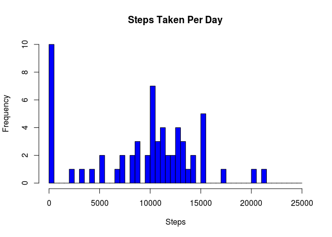
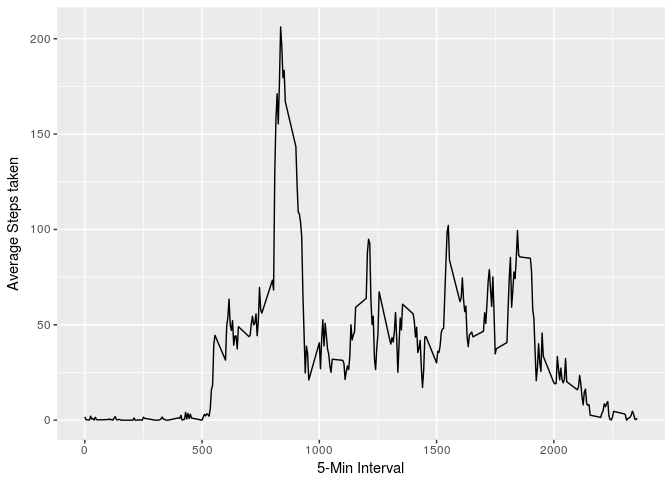
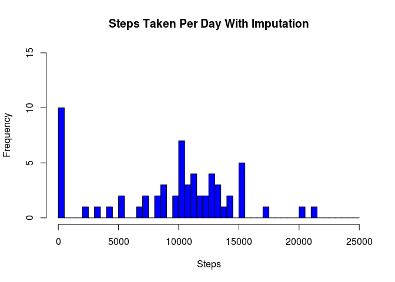
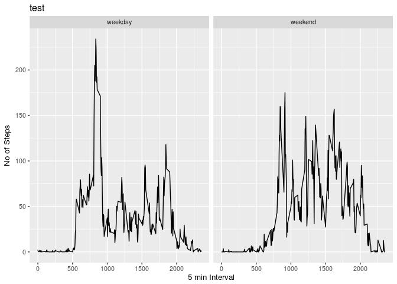

# Reproducible Research: Peer Assessment 1


## Loading and preprocessing the data

```r
activityData <- read.csv("activity.csv", header = TRUE, sep = ",")
stepsPerDay <- aggregate(activityData$steps, by=list(activityData$date), 
                         FUN=sum, na.rm=TRUE)
hist(x=stepsPerDay$x,main = "Steps Taken Per Day", xlab="Steps", col="blue",breaks=seq(from=0, to=25000, by=500),ylim=c(0, 10))
```

<!-- -->

## What is mean total number of steps taken per day?


```r
meanStepsPerDay <- mean(stepsPerDay$x, na.rm=TRUE)
medianStepsPerDay <- median(stepsPerDay$x, na.rm=TRUE)
```

Mean of Steps per day is 9354.2295082 and Median for Steps per day is 10395

## What is the average daily activity pattern?

```r
stepsPer5min <- aggregate(activityData$steps, by=list(activityData$interval), 
                         FUN=mean, na.rm=TRUE, na.action=NULL)
names(stepsPer5min) <- c("interval", "steps")

library(ggplot2)

ggplot(stepsPer5min, aes(interval, steps)) + geom_line() + xlab("5-Min Interval") + ylab("Average Steps taken")
```

<!-- -->

```r
maxStepInterval = stepsPer5min$interval[stepsPer5min$steps==max(stepsPer5min$steps)]
```
The 5-minute interval that contains the maximum of steps, on average across all days, is 835.

## Imputing missing values

```r
missingValues <- sapply(activityData, function(x) sum(is.na(x)))
```
Total Number of Missing Values in Data Set 2304


```r
mergeDF <- merge(activityData, stepsPer5min, by="interval", suffixes=c(".activityData", ".stepsPerDay"))

mergeDF$steps.activityData[is.na(mergeDF$steps.activityData)] <- mergeDF$steps.stepsPerDay
```

```
## Warning in mergeDF$steps.activityData[is.na(mergeDF$steps.activityData)] <-
## mergeDF$steps.stepsPerDay: number of items to replace is not a multiple of
## replacement length
```

```r
mergeDFstepsPerDay <- aggregate(mergeDF$steps.activityData, by=list(mergeDF$date), 
                         FUN=sum, na.rm=TRUE, na.action=NULL)
hist(x=mergeDFstepsPerDay$x,main = "Steps Taken Per Day With Imputation", xlab="Steps", col="blue",breaks=seq(from=0, to=25000, by=500),ylim=c(0, 15))
```

<!-- -->

```r
mergeDFmeanStepsPerDay <- mean(mergeDFstepsPerDay$x, na.rm=TRUE)

mergeDFmedianStepsPerDay <- median(mergeDFstepsPerDay$x, na.rm=TRUE)
```
Mean of Steps per day with Imputated data is 9371.4370554 and Median for Steps per day is 1.0395\times 10^{4}

## Are there differences in activity patterns between weekdays and weekends?

```r
activityData$week <- ifelse(weekdays(as.Date(activityData$date)) %in% c("Saturday", "Sunday"), "weekend", "weekday")

stepsPer5minWeekData <- aggregate(activityData$steps, by=list(activityData$week, activityData$interval), 
                                FUN=mean, na.rm=TRUE, na.action=NULL)
names(stepsPer5minWeekData) <- c("DayOfWeek", "Interval", "Steps")
ggplot(stepsPer5minWeekData, aes(Interval, Steps))+ 
  geom_line()+ 
  facet_grid(. ~ DayOfWeek)+
  theme_grey(base_size = 4)+ theme_grey(base_size = 10)+ 
  xlab("5 min Interval")+
  ylab("No of Steps")+
  ggtitle("test")
```

<!-- -->
